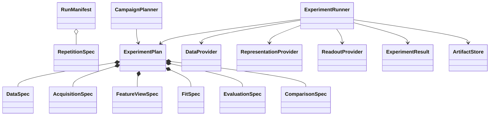

# Empirical Evaluation Framework

The experiment domain models one paired repetition, not one model fit and not
an entire campaign. Its identity is the campaign, repetition, and semantic
manifest digest. Artifact paths and stopping stages are operational choices and
do not affect that identity.



## Domain boundaries

- `DataSpec` identifies independent train or test trajectories, tasks, windows,
  and pairing relationships.
- `AcquisitionSpec` owns one maximal campaign-local cache.
- `FeatureViewSpec` derives legal resource prefixes without reacquisition.
- `FitSpec` can reference training views only.
- `EvaluationSpec` applies a frozen fit to a declared train or held-out view.
- `ComparisonSpec` makes shared-readout and shared-denominator semantics explicit.
- Every node carries an explicit `study_id`; dependency edges crossing studies
  are invalid. Study selection never relies on node-name prefixes.

The planners are pure deterministic functions. Numerical behavior is supplied
through data, representation, and readout protocols. The initial fake provider
exercises the full lifecycle without claiming to implement the paper numerics.

## Prefix ownership

Campaign I owns a maximal `R=64` branch draw. Campaign II owns `M=8192`
grouped-measurement outcomes per setting. Campaign III owns an exact
`S=256, R=32` candidate pool and a separate measured pool-ranking cache. A
single acquisition is rejected if it attempts to prefix all of `R`, `S`, and
`M`.

Path-keyed random streams derive directly from `(root seed, semantic path)`.
Adding a new stream cannot shift existing train, test, projection, design, or
measurement streams.


## Identities

`RunManifest.digest` hashes only semantic configuration, including the locked
contract digest and pre-run choices. It excludes the artifact root. One
experiment is the tuple `(campaign, repetition index, manifest digest)`.

Every node adds its specification, plan digest, stage, versioned provider
identity, and ordered upstream digests to that identity. Provider kind,
algorithm version, backend kind, and numerical precision prevent fake and
numerical artifacts from sharing a cache entry. GPU ID and chunk size are
operational metadata and do not change identity. Requested stopping stages
therefore do not change either experiment or node identity.

## Cache shapes

| Campaign | Maximal acquisition | Legal derived views |
| --- | --- | --- |
| I | `tau_plus x R=64` exact branch design with shared pure histories | `tau_plus` selections, `R` prefixes, width and observable-bank views |
| II | `M=8192` grouped outcomes or one causal proxy | `M`, `w`, or `N` prefixes |
| III | exact `(S=256, R=32)` pool; separate measured `S=64` pool | `(S,R)`, `(S,N)`, or measured `S` prefixes |

No acquisition may materialize the unrelated `R_max * S_max * M_max` product.

## Provider extension

Providers consume validated specifications; they do not reconstruct semantics
from node names. A data provider can start with this boundary:

```python
from src.experiment import DataSpec, NodePayload, ProviderIdentity
from src.experiment.seeding import PathSeedTree


class NumpyTrajectoryProvider:
    identity = ProviderIdentity(
        "example_data", "v1", "numpy_cpu", "float64"
    )

    def prepare(self, spec: DataSpec, seeds: PathSeedTree) -> NodePayload:
        rng = seeds.generator(f"data/{spec.study_id}/{spec.split}")
        inputs = rng.normal(size=(spec.sample_count, spec.input_dim))
        return NodePayload(
            metadata={"split": spec.split},
            assets={"inputs": inputs},
        )
```

The first numerical implementation is intentionally study-local:
`memory_vs_lag` uses one `tau_plus x R_max=64` exact balanced-reservoir
acquisition per split. The mixer and input-dependent pure reset histories do
not depend on the reset rate, so they are evolved once and contracted against
all locked geometric rate vectors. Endpoint views and the reportable `R=16`
prefix are array slices. Each endpoint still receives its own multi-output
readout and separate NEMSE artifacts per lag.

Representation and readout providers follow the same rule: consume explicit
specification fields and return typed payloads without reconstructing graph
semantics from IDs.
