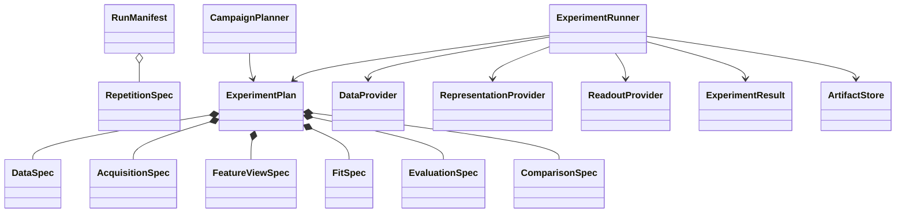

# Empirical Evaluation Framework

The experiment domain models one paired repetition, not one model fit and not
an entire campaign. Its identity is the campaign, repetition, and semantic
manifest digest. Artifact paths and stopping stages are operational choices and
do not affect that identity.



## Domain boundaries

- `DataSpec` identifies independent train or test trajectories, tasks, windows,
  and pairing relationships.
- `AcquisitionSpec` owns one maximal campaign-local cache.
- `FeatureViewSpec` derives legal resource prefixes without reacquisition.
- `FitSpec` can reference training views only.
- `EvaluationSpec` applies a frozen fit to a declared train or held-out view.
- `ComparisonSpec` makes shared-readout and shared-denominator semantics explicit.

The planners are pure deterministic functions. Numerical behavior is supplied
through data, representation, and readout protocols. The initial fake provider
exercises the full lifecycle without claiming to implement the paper numerics.

## Prefix ownership

Campaign I owns a maximal `R=64` branch draw. Campaign II owns `M=8192`
grouped-measurement outcomes per setting. Campaign III owns an exact
`S=256, R=32` candidate pool and a separate measured pool-ranking cache. A
single acquisition is rejected if it attempts to prefix all of `R`, `S`, and
`M`.

Path-keyed random streams derive directly from `(root seed, semantic path)`.
Adding a new stream cannot shift existing train, test, projection, design, or
measurement streams.


## Identities

`RunManifest.digest` hashes only semantic configuration, including the locked
contract digest and pre-run choices. It excludes the artifact root. One
experiment is the tuple `(campaign, repetition index, manifest digest)`.

Every node adds its specification, plan digest, stage, and ordered upstream
digests to that identity. Requested stopping stages therefore do not change
either experiment or node identity.

## Cache shapes

| Campaign | Maximal acquisition | Legal derived views |
| --- | --- | --- |
| I | `R=64` exact branch design | `R` prefixes, width and observable-bank views |
| II | `M=8192` grouped outcomes or one causal proxy | `M`, `w`, or `N` prefixes |
| III | exact `(S=256, R=32)` pool; separate measured `S=64` pool | `(S,R)`, `(S,N)`, or measured `S` prefixes |

No acquisition may materialize the unrelated `R_max * S_max * M_max` product.

## Provider extension

Providers consume validated specifications; they do not reconstruct semantics
from node names. A data provider can start with this boundary:

```python
from typing import Mapping

from src.experiment import DataSpec
from src.experiment.seeding import PathSeedTree


class NumpyTrajectoryProvider:
    def prepare(self, spec: DataSpec, seeds: PathSeedTree) -> Mapping[str, object]:
        rng = seeds.generator(f"data/{spec.split}/{spec.trajectory_id}")
        inputs = rng.normal(size=(spec.sample_count, spec.input_dim))
        return {"inputs": inputs.tolist()}
```

Representation and readout providers follow the same rule: use explicit spec
