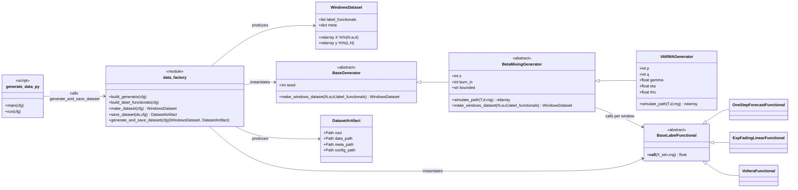

# `src.data` package overview

This package implements the **synthetic data layer** used in the numerical validation section:

- it **generates windowed inputs** `X ∈ R^{N×w×d}` from a chosen stochastic process (e.g., VARMA),
- it **labels each window** using one or more scalar **label functionals**,
- it optionally **persists** datasets + metadata to disk for later experiment runs.

The package is designed so you can **ablate independently**:
- sampling geometry (`N`, `w`, `d`, spacing `s`, burn-in),
- process family / parameters (e.g., VARMA orders, innovation distribution),
- label task(s) (forecast-like, fading sums, Volterra-like nonlinearity, noise, …).

---

## Big picture: data flow

1. **Config (Hydra)** chooses:
   - sampling parameters (`N`, `w`, `d`, `s`, …),
   - a process generator (`process.generator`),
   - a list of label functionals (`functionals.items`),
   - output settings (format, save dir, overwrite policy).
2. `src.data.factory.make_dataset(cfg)`:
   - instantiates the generator and label functionals via `hydra.utils.instantiate`,
   - calls `generator.make_windows_dataset(...)`,
   - returns a `WindowsDataset(X, y, meta, label_functionals)`.
3. `src.data.factory.save_dataset(ds, cfg)`:
   - saves `{X, y}` (e.g., `.npz`) and optional metadata/config files,
   - returns a `DatasetArtifact` describing saved paths.
4. `src.experiment.scripts.generate_data` is the CLI entrypoint that composes configs and calls
   `generate_and_save_dataset(cfg)`.

---

## Mermaid class diagram



---

## Package layout

### `src.data.generate`
Generators produce the *inputs* `X` by simulating a process and slicing it into windows.

- `generate/base.py`
  - `WindowsDataset`: container for `(X, y, meta, label_functionals)`
  - `BaseGenerator`: abstract generator interface
  - `ensure_bounded(...)`: optional mapping into `(-1,1)` (tanh/clip/none)

- `generate/beta_mixing.py`
  - `BetaMixingGenerator`: “one realization + spaced windows” generator
    - simulates a path of length `T`,
    - constructs windows with stride `(w + s)` starting after `burn_in`,
    - applies label functionals to each window.

- `generate/varma.py`
  - `VARMAGenerator(BetaMixingGenerator)`: stable VARMA(p,q) generator with a sufficient
    stability construction (norm budget for AR part).

### `src.data.label`
Label functionals produce *scalar* targets from a window `X_win ∈ R^{w×d}`.

- `label/base.py`
  - `BaseLabelFunctional`: interface `__call__(X_win, rng) -> float`
  - `LabelNoise`: optional additive noise model

- `label/functionals.py`
  - `OneStepForecastFunctional`: `y = <u, x_t>` (window’s last point)
  - `ExpFadingLinearFunctional`: `y = Σ α^k <u, x_{t-k}>`
  - `VolteraFunctional`: a simple second-order (Volterra-style) functional
    combining fading projections

### `src.data.factory`
Orchestration layer consuming a Hydra config and producing datasets.

- `build_generator(cfg)`: instantiates `cfg.process.generator`
- `build_label_functionals(cfg)`: instantiates each entry in `cfg.functionals["items"]`
- `make_dataset(cfg)`: returns `WindowsDataset`
- `save_dataset(ds, cfg)`: persists data, meta, resolved config
- `generate_and_save_dataset(cfg)`: convenience wrapper

---

## Minimal usage (Python)

This is the simplest “in-process” flow (useful in notebooks / quick checks):

```python
from hydra import compose, initialize_config_dir
from hydra.core.global_hydra import GlobalHydra
from pathlib import Path

from src.data.factory import make_dataset, generate_and_save_dataset
from src.settings import PROJECT_ROOT_PATH

# 1) Point Hydra to your data config root
GlobalHydra.instance().clear()
conf_dir = Path(PROJECT_ROOT_PATH) / "experiment" / "conf" / "data"

with initialize_config_dir(version_base=None, config_dir=str(conf_dir)):
    cfg = compose(
        config_name="config",
        overrides=[
            "sampling=tiny",
            "process=varma",
            "functionals=one_step",
            "noise=none",
            "output.save_dir=/tmp/synth",
            "output.name=auto",
            "output.format=npz",
            "output.overwrite=true",
        ],
    )

# 2a) Generate in-memory only
ds = make_dataset(cfg)
print(ds.X.shape, ds.y.shape, ds.meta["process_kind"])

# 2b) Or generate + save
ds, art = generate_and_save_dataset(cfg)
print("Saved:", art.data_path)
```

---

## Hydra config structure

A typical `experiment/conf/data/config.yaml` looks like:

```yaml
defaults:
  - sampling: default
  - process: varma
  - functionals: one_step
  - noise: none
  - output: default
  - _self_

seed: 12345
```

Where each group defines its own schema, e.g.:

- `sampling/*.yaml`: `{N, w, d, s, burn_in, bounded, clip}`
- `process/*.yaml`: `kind` + `generator: {_target_: ..., ...}`
- `functionals/*.yaml`: `kind` + `items: [ {_target_: ...}, ... ]`
- `output/*.yaml`: `{save_dir, name, format, overwrite, save_meta, save_config}`

### Recommended output organization (per process)

If you want per-process folders, you can set:

```yaml
# experiment/conf/data/output/default.yaml
save_dir: storage/data/synthetic/${process.kind}
```

---

## How this is used in `generate_data.py`

The experiment entrypoint composes a single config and calls the factory:

```python
# src/experiment/scripts/generate_data.py
from src.data.factory import generate_and_save_dataset

ds, art = generate_and_save_dataset(cfg)
print(f"Saved X{ds.X.shape}, y{ds.y.shape} -> {art.data_path}")
```

### CLI usage

Generate one dataset:

```bash
python -m src.experiment.scripts.generate_data   sampling=tiny process=varma functionals=one_step noise=none   output.save_dir=storage/data/synthetic/varma   output.name=auto output.format=npz output.overwrite=true
```

Run a sweep to generate many datasets (ablation grid):

```bash
python -m src.experiment.scripts.generate_data -m   sampling.N=64,256 sampling.w=10,25 sampling.d=2,5   process=varma functionals=one_step,exp_fading   output.name=auto output.format=npz output.overwrite=true
```

Hydra will create a *multirun* directory structure; inside each run directory,
your `output.save_dir` controls where the dataset artifact is written.

---

## Where this plugs into the rest of the repo

Downstream packages typically consume:

- `ds.X` as the raw windows `X ∈ R^{N×w×d}`,
- `ds.y[l]` as labels for task `l` (supporting multi-functional labels).

For example, the QRC pipeline often looks like:

1. `X` → circuit/PUB construction (circuits package)
2. PUBs → execution (run package)
3. results → feature maps `Φ`
4. `Φ, y` → model training/evaluation (models package)
